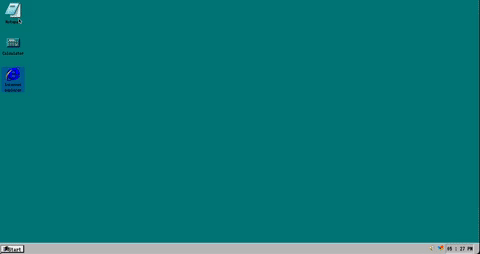

# Fake Windows 98

# Purpose

The goal of this project is to have students explore and consolidate their understandings of HTML, CSS and JavaScript.
This project will require you to replicate the layout and format of a design/image using CSS, add content via HTML and control the interactive elements via JavaScript.\

# Image

# Link

# Setup

# MVP

- FEATURES:

  - You will be creating an SPA (Single Page Application) - [ x ]
  - Desktop has a wallpaper that fits the viewport -[ x ]
  - There will be selectable icons - [ x ]
  - Selecting an icon will open an "app", creating a _modal_ to display some content - [ x ]
  - Able to close an app - [ x ]
  - There will be a selectable menu - [ x ]
  - Selecting the menu will display a list of text and icons - [ x ]
  - The current time is displayed somewhere -[ x ]

- HTML/CSS - [ x ]

  - Wallpaper scales to fit the viewport - [ x ]
  - Minimum 3 icons on desktop - [ x ]
  - The menu is positioned in the appropriate place - [ x ]
  - Apps look consistent - [ x ]
  - Menu contains a flex with content inside it - [ x ]
  - Apps should be able to contain text, an image or a form - [ x ]

- JS - [ ]

  - Put your js code into separate files - [ x ]
  - Your icons and menu should add event listener for the click event, don't use the html onclick attribute - [ x ]
  - Give your functions and variables good names - [ x ]
  - Use the arrow syntax to declare functions - [ x ]

- GITHUB - [ ]
  - Create a repo on github with a README - [ x ]
  - Clone Repo - [ X ]
  - Create and checkout develop branch - [ x ]
  - Push all changes to your develop branch - [ x ]
  - When submitting create a pull request from develop into main for review - [ x ]
  - Add coach as a reviewer - [ x ]

## Approach

23/11/2022
Implemented:

- Basic taskbar with buttons as placeholders for icons. Rendered via JS.
- Added a clock.
- Added a start button.

To-do:

- Change the buttons in taskbar to their respective icons.
- Change the text inside the Start button to mimic Windows 98.
- Style the taskbar to look like Windows 98.
- Add event listeners to icon/buttons.
- Add event listener to start button to show a menu.

25/11/2022
Implemented:

- Desktop view - [ x ]
- Icons rendered on taskbar - [ x ]
- Complete layout of desktop - [ x ]
- Icons on desktop can be highlighted upon click - [ x ]
  - Behaves similar to windows - [ x ] (may have to skip)

To-do:

- Create a start menu - [ x ]
- Put an empty folder in start menu -[ x ]
- create a functional notepad - [ x ]
- create a functional calculator - [ x ]

Notes:

- Having a lot of issue with the icons highlighted. Current logic is to check which classes have the highlighted styling and then remove it. after that it will add the highlighted class to the target icon. Double clicking will cause a modal box to open.

26/11/2022

- Border around the time.
- Icons are now selectable one at a time.
- Created a template modal box.

27/11/2022

- functioning boxes that can minimize and close.
- Notepad app can input text.
- Used iframe to show google but due to limitations it refuses to connect.
- Can open apps via double clicking on icon.
  - Only works for IE, calculator and notepad for functional purposes. in futre, all icons on desktop will have same functionality.
- Start menu styled.

To-do:

- Functional calculator - [ x ]
- Programs opens up a new modal box -[ x ]

28/11/2022

- Had to replace google iframe with an image as unable to unblock the iframe.
- Unable to find a solution to unhighlight icons upon clicking desktop.
- Basic functionality achieved.

# Reflections

# Future Goals

- Refactor code to make it look cleaner.
- Refactor CSS to make it look cleaner.
- Before starting a project, write out pseudo code or a plan on what to do. By extension, figure out at the beginning how to break down the task into smaller manageable bits.

# Further reading

# Stay in touch

# Licence

# Contribution
